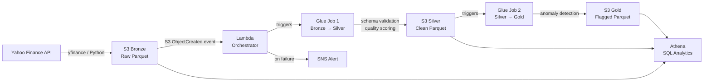

# FinSight — Market Data Pipeline on AWS

> An end-to-end, production-style data engineering pipeline that ingests real stock market data, validates it through a three-layer medallion architecture, and automatically flags statistical anomalies in price and volume — built entirely on AWS serverless and managed services.

---

## The Problem

Financial data is messy and arrives continuously. Raw price feeds contain nulls, schema inconsistencies, stale timestamps, and occasional spikes that could be genuine market events — or data errors. Without a reliable pipeline, downstream risk models, dashboards, and compliance reports are built on a shaky foundation.

FinSight automates the full journey from raw API data to a clean, queryable, anomaly-flagged analytics layer. It is the kind of pipeline a trading firm, bank, or fintech would run in production to monitor data integrity and power downstream analytics.

---

## Architecture



### AWS Services Used

| Service | Role | Why this over alternatives |
|---|---|---|
| **S3** | Three-layer medallion storage (Bronze / Silver / Gold) | Cost-effective, scalable, native integration with Glue and Athena |
| **AWS Glue** | PySpark ETL — cleaning, validation, anomaly detection | Managed Spark without cluster management; native Glue Data Catalog integration |
| **Lambda** | Event-driven orchestration — S3 trigger → Glue | Serverless, zero-cost when idle, ideal for event-driven pipelines |
| **EventBridge** | Daily schedule for ingestion | Decouples scheduling from compute; no always-on infrastructure |
| **Athena** | SQL analytics across all three layers | Serverless, pay-per-query, no data movement required |
| **Glue Data Catalog** | Schema registry for all S3 layers | Single source of truth for table definitions across Glue and Athena |
| **SNS** | Failure alerting | Lightweight, extensible to email / Slack / PagerDuty |

---

## Data Flow

### 1. Ingestion — Yahoo Finance → S3 Bronze

An EventBridge rule fires daily and invokes the ingestion script. It pulls OHLCV (Open, High, Low, Close, Volume) data for 15 tickers across five sectors using the `yfinance` library — no API key required.

Raw data is written to S3 Bronze as **partitioned Parquet**:

```
s3://finsight-bronze/
  ticker=AAPL/
    date=2024-01-15/
      data.parquet
  ticker=MSFT/
    date=2024-01-15/
      data.parquet
```

Partitioning by ticker and date means Athena only scans the partitions it needs — critical for cost and query performance at scale.

### 2. Transformation — S3 Bronze → S3 Silver (Glue Job 1)

A Lambda function detects the new Bronze file and triggers the Silver Glue PySpark job. It performs:

- **Schema validation** — expected columns present, correct data types
- **Null checks** — all OHLCV fields must be non-null
- **Timestamp standardisation** — all timestamps normalised to UTC
- **Quality scoring** — each row is stamped with a `quality_status`:

| Status | Condition |
|---|---|
| `PASS` | All checks pass |
| `WARN` | Minor issues (e.g. volume = 0 on a trading day) |
| `FAIL` | Critical issues (e.g. null close price, negative volume) |

A `data_quality_report.json` is written per run to `/reports/` summarising pass rates by ticker and date — giving full auditability of every ingestion cycle.

### 3. Anomaly Detection — S3 Silver → S3 Gold (Glue Job 2)

The Gold job reads from Silver and runs **statistical anomaly detection** on daily returns and volume per ticker.

For each ticker, it computes a 30-day rolling mean (μ) and standard deviation (σ). A row is flagged as an anomaly if:

```
|value - μ| > 2.5σ
```

Flagged records receive three additional columns:

| Column | Values | Description |
|---|---|---|
| `anomaly_type` | `price_spike` / `volume_spike` / `both` | What triggered the flag |
| `anomaly_score` | float | Number of standard deviations from mean |
| `severity` | `low` / `medium` / `high` | Based on anomaly_score magnitude |

**Why Z-score over a machine learning model?**  
Financial services operates under strict regulatory scrutiny. Every flagged anomaly must be explainable to a compliance or risk team. A Z-score approach is fully auditable — you can show exactly why a record was flagged, what the rolling baseline was, and how the threshold was set. A black-box model cannot offer this transparency without significant additional tooling.

### 4. Analytics — Athena

Glue Data Catalog tables are registered for all three layers. Sample queries in `/athena-queries/`:

```sql
-- Daily anomaly count by ticker
SELECT ticker, date, COUNT(*) AS anomaly_count
FROM gold_market_data
WHERE anomaly_type IS NOT NULL
GROUP BY ticker, date
ORDER BY anomaly_count DESC;

-- Data quality pass rate by ingestion date
SELECT ingestion_date,
       ROUND(100.0 * SUM(CASE WHEN quality_status = 'PASS' THEN 1 ELSE 0 END) / COUNT(*), 2) AS pass_rate_pct
FROM silver_market_data
GROUP BY ingestion_date
ORDER BY ingestion_date DESC;

-- Tickers with 3+ consecutive anomaly days
SELECT ticker, date, anomaly_type, anomaly_score
FROM gold_market_data
WHERE anomaly_type IS NOT NULL
ORDER BY ticker, date;
```

---

## Data Quality Framework

The Silver layer implements a lightweight data quality framework inspired by production data validation patterns used in regulated industries.

Every ingestion run produces:

1. **Row-level quality flags** — `quality_status` column on every record
2. **Run-level quality report** — JSON summary written to `/reports/quality/`
3. **Audit trail** — S3 versioning enabled on Bronze ensures raw data is never lost

```json
{
  "run_id": "2024-01-15T09:00:00Z",
  "ticker": "AAPL",
  "total_records": 252,
  "pass_count": 249,
  "warn_count": 2,
  "fail_count": 1,
  "pass_rate_pct": 98.8,
  "checks_applied": ["null_check", "schema_validation", "timestamp_utc", "volume_non_negative"]
}
```

---

## Repository Structure

```
finsight-market-pipeline/
├── ingestion/
│   └── ingest_market_data.py       # Yahoo Finance → S3 Bronze
├── glue-jobs/
│   ├── bronze_to_silver.py         # Cleaning, validation, quality scoring
│   └── silver_to_gold.py           # Anomaly detection, flagging
├── lambda/
│   └── orchestrator.py             # S3 trigger → Glue + SNS on failure
├── athena-queries/
│   ├── anomaly_summary.sql
│   ├── quality_pass_rate.sql
│   ├── top_volatile_tickers.sql
│   ├── anomaly_vs_normal_volume.sql
│   └── consecutive_anomalies.sql
├── docs/
│   ├── data-quality-framework.md   # Full quality check reference
│   └── anomaly-detection-design.md # Z-score methodology and thresholds
├── reports/                        # Auto-generated quality reports (gitignored)
├── requirements.txt
└── README.md
```

---

## Getting Started

### Prerequisites

- AWS account (all services used are free tier eligible for this project scale)
- Python 3.9+
- AWS CLI configured (`aws configure`)
- Permissions: S3, Glue, Lambda, Athena, EventBridge, SNS, IAM

### Setup

```bash
git clone https://github.com/YOUR_USERNAME/finsight-market-pipeline.git
cd finsight-market-pipeline
pip install -r requirements.txt
```

### Create S3 Buckets

```bash
aws s3 mb s3://finsight-bronze
aws s3 mb s3://finsight-silver
aws s3 mb s3://finsight-gold

# Enable versioning on Bronze for audit trail
aws s3api put-bucket-versioning \
  --bucket finsight-bronze \
  --versioning-configuration Status=Enabled
```

### Run Ingestion Manually

```bash
python ingestion/ingest_market_data.py --date 2024-01-15
```

### Deploy Lambda Trigger

```bash
cd lambda
zip orchestrator.zip orchestrator.py
aws lambda create-function \
  --function-name finsight-orchestrator \
  --runtime python3.11 \
  --handler orchestrator.lambda_handler \
  --zip-file fileb://orchestrator.zip \
  --role arn:aws:iam::YOUR_ACCOUNT_ID:role/finsight-role
```

### Register Athena Tables

Run the DDL statements in `/athena-queries/create_tables.sql` in the Athena console, pointing at your S3 bucket paths.

---

## Sample Output

### Quality Report (Silver layer)

```
Ticker   | Records | PASS  | WARN | FAIL | Pass Rate
---------|---------|-------|------|------|----------
AAPL     | 252     | 249   | 2    | 1    | 98.8%
MSFT     | 252     | 252   | 0    | 0    | 100.0%
TSLA     | 252     | 241   | 7    | 4    | 95.6%
```

### Anomaly Flags (Gold layer)

```
Ticker | Date       | Close  | Anomaly Type  | Score | Severity
-------|------------|--------|---------------|-------|----------
TSLA   | 2024-02-05 | 189.30 | price_spike   | 3.21  | high
GME    | 2024-01-26 | 347.51 | both          | 4.87  | high
AAPL   | 2024-08-05 | 209.82 | volume_spike  | 2.63  | medium
```

---

## Future Improvements

- **CloudWatch dashboards** — pipeline run metrics, anomaly rates, quality trends over time
- **Unit tests** — pytest coverage for the PySpark transformation logic and quality checks
- **Terraform IaC** — full infrastructure-as-code so the entire stack deploys in one command
- **Kinesis Data Streams** — replace daily batch ingestion with real-time tick data processing
- **Notification layer** — Slack or email alerts when anomaly rate exceeds threshold for a ticker
- **Backtesting** — validate anomaly detection thresholds against known market events (e.g. March 2020, GameStop squeeze)

---

## Tickers Covered

Five sectors, three tickers each — chosen to give broad market coverage and expose the pipeline to different volatility profiles.

| Sector | Tickers |
|---|---|
| Technology | AAPL, MSFT, NVDA |
| Finance | JPM, GS, BAC |
| Energy | XOM, CVX, SLB |
| Healthcare | JNJ, PFE, UNH |
| Consumer | AMZN, TSLA, WMT |

---

## Why This Project

This pipeline was built to demonstrate production-grade data engineering thinking — not just wiring AWS services together, but making deliberate choices about data quality, auditability, and architecture that reflect how financial data infrastructure actually works in practice.

The medallion architecture, row-level quality flags, audit trail via S3 versioning, and explainable anomaly detection are all patterns drawn from real-world regulated data environments where you cannot afford to lose data lineage or produce unexplainable outputs.

---

## Licence

MIT — free to use, fork, and build on.

---

*Built by Aarohi Gupta · [LinkedIn](https://www.linkedin.com/in/aarohi-gupta) · [GitHub](https://github.com/initaarohi)